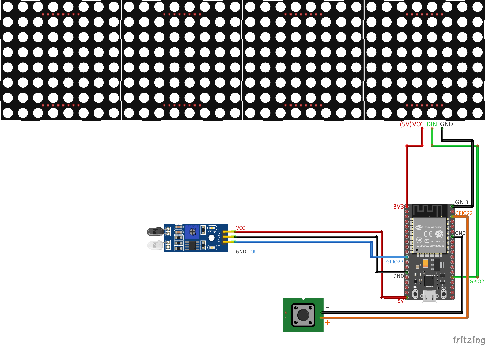

# Manuel D'Utilisation
Chrono de vitesse pour l'escalade

## Branchements

## Fonctionnement
* Rester 2 secondes sur la plaque au sol jusqu'à ce que l'écran passe au vert.
* Taper en face du crochet (pas dessus), environ 8cm.

## Fonctionnalité Bluetooth
Application **BluefruitConnect**  
img 1
img 2

## Model 3D
* Le crochet fait par Clément sur mesure pour le mur du Club avec un cache cable.  
  |  
  -----> Fichier `crochet.stl`  
  
* Le Boitier (n'existe pas encore).  
  |  
  -----> Fichier `boitier.stl`  

## Créateurs du Chrono
* Clément
* Paul
* Gaspard
* Marin
* Nicolas
* Camille
